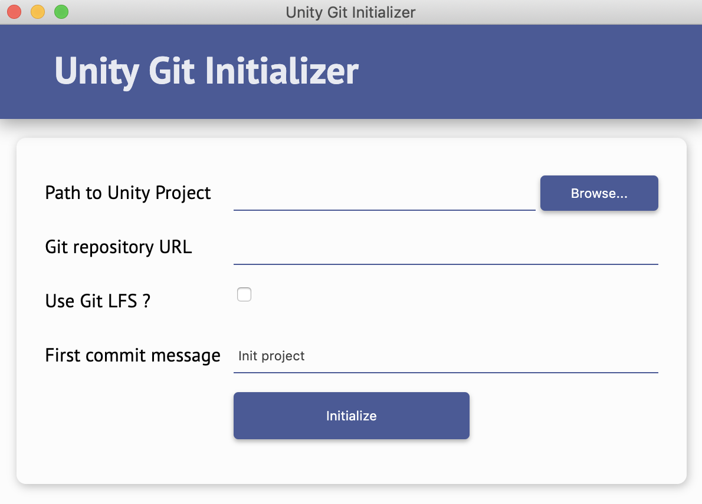

# Unity Git Initializer

Tool for initializing Git repository in an existing Unity project.

Available on Mac or Windows.



## Direct download

... coming soon!

## Build the application

To build the application :

1. Download and install [node.js](https://nodejs.org/en/)
2. Clone this repository

```
git clone https://github.com/DaCookie/unity-git-initializer.git
```

3. Open the project folder
4. Install Node dependencies

```
npm install
```

5. Generate executable (Mac or Windows)

```
npm run build
```

This command will generate a `*.exe` if you are on Windows, or a `*.app` if you are on Mac that you can run instantly.

## Usage

### *Path to your Unity project* (required)

Path to your project's folder.

### *Git repository URL*

URL to your online repository.

If given, the application will push your project after initializing Git inside. If you let the field empty, nothing happens.

### *Use Git LFS ?*

Defines if you want to use Git LFS. Note that it must be installed on your machine to use it (see [https://git-lfs.github.com](https://git-lfs.github.com) for more informations).

### *First commit message*

The message to use for your first commit. If not given, your first commit will have the default message, which is "Init project".